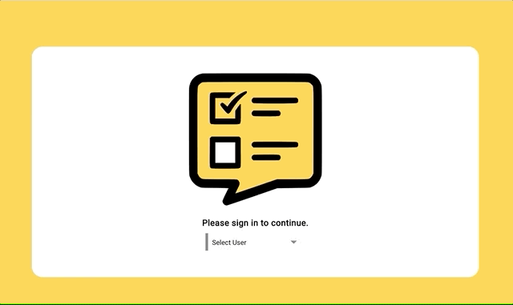
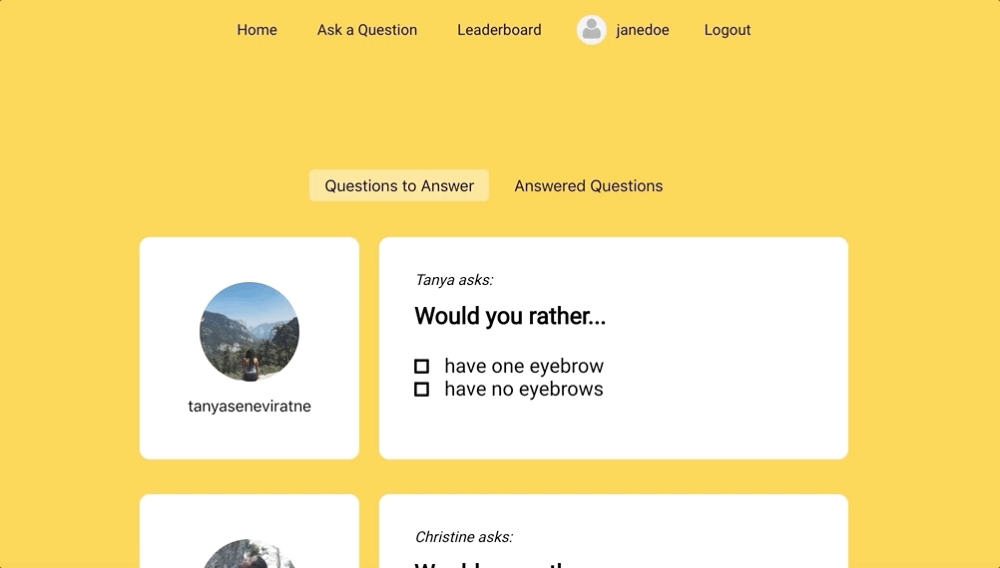
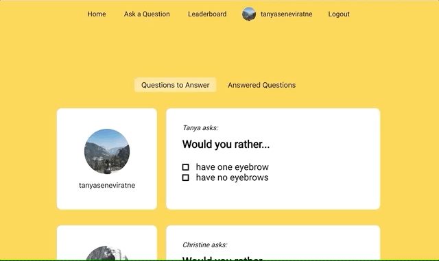
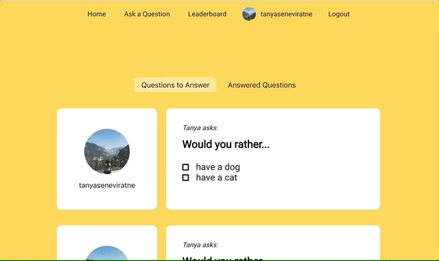

# Would You Rather?

Would You Rather? is re-make of the classic game of preference.

[live link]

Would You Rather? utilizes the following:

* React
* Redux
* HTML
* CSS
* NPM
* create-react-app
* react-router

# Features

### Login

Users must select a user profile from a precomposed list before playing. If the user navigates anywhere by entering a URL in the address bar and is not authenticated, they will be re-directed to the login page and asked to sign in via react-router. Once the user is logged in, the homepage is shown.

<p align="center">
  
</p>

### Homepage

Once the user in authenticated, users are able to navigate to the question submission form, leaderboard, homepage, and back to the login page. The user is able to toggle between a list of questions they haven't answered and a list of questions they have already answered. The questions in both categories are arranged by most recently created to least recently created. The unanswered questions are displayed by default.

Unanswered question format:
  1. Author of question
  2. Question
  3. The options to choose from

Answered question format:
  1. Question
  2. The options to choose from
  3. The number of people who voted for that option
  4. The option the authenticated user chose.

<p align="center">
  
</p>

### Create a New Question

To submit a new question, users can click on 'Add New Question' and the application will show a form with inputs for the question, option one, and option two. Once the form has been submitted, the user will be re-directed to the homepage and the new question should appear under 'Questions to Answer.'

<p align="center">
  
</p>

### Leaderboard

For some added fun, the application has a leaderboard that shows each user with the number of questions they've asked and answered shown as a sum score.

Users are listed in descending order based on their score. The more questions the user asks and answers, the higher they move up the leaderboard!

<p align="center">
  
</p>

## Data

The `_DATA.js` file represents a fake database with API methods to access the data.

The database contains two types of objects and six API methods:

* Objects:
  * Users
  * Questions

* API Methods:
  * `_getUsers()`
  * `_getQuestions()`
  * `_saveQuestion(question)`
  * `_saveQuestionAnswer(object)`
  * `_updateAuthedUser(user)`
  * `_saveAvatar(object)`

## Installation

### Clone

```shell
$ git clone https://github.com/jessicsw/Would-You-Rather
```

### Setup

Install project dependencies:

```shell
npm install
```

Start the development server:

```shell
npm start
```

# Future Releases

- [ ] Timestamp on posted questions
- [ ] Comment section